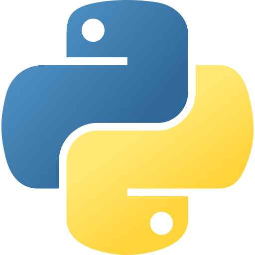

<h1 align="center">
     Matt Bolaños
</h1>

    
    
    

<h3>Hi There!</h3>

👨‍💻 I currently work at the Golden State Warriors

👷 I build full stack web applications and data visualizations

👨‍🍳 I love learning new programming languages and cooking recipes

<h3>Stack</h3>
<h4>Core</h4>

    
    
    
    

<h4>Frontend</h4>

    
    
    
    
    

<h4>Backend</h4>

    
    
    
    
    

