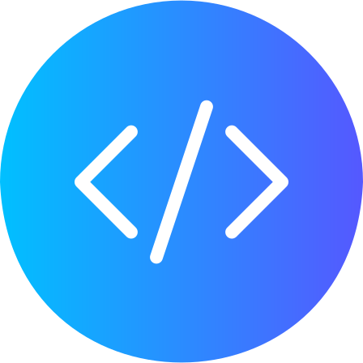

<h1 style="display: flex; align-items: center; justify-content: center; gap: 5px;"
align='center'>
    Matt Bolaños
</h1>

    
    
    

<h3>Hi There!</h3>

👨‍💻 I currently work at the Golden State Warriors

👷 I build full stack web applications and data visualizations

👨‍🍳 I love learning new programming languages and cooking recipes

